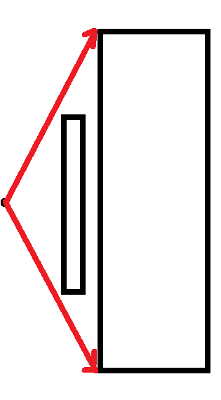

As I’d finished implementing the linear program optimization last week, I spent much of Monday using it on rooms I’d generated to make sure it worked and getting various results. For algorithms like this, where it’s not possible for a human to compute the correct solutions on their own for large examples, I find it useful to create very simple examples initially, where I can directly deduce what the answers should be. Then, the algorithm working for those small examples gives me more confidence that it’s working correctly. For example, I used a really small example of a single-obstacle room first to see how the program worked: 

This example worked, so I got results for a few other rooms. With my mentor, I discussed what data would be useful to collect. First, we wanted to see how the resolution of vantage point selection affected the optimized dwell-time. To formulate the linear program, we first need to actually select which points in the room’s free space we want as potential vantage points. Obviously, there’s an uncountably infinite number of possible points to select, and we can’t use all of them. So, we did the next best thing; we discretized the room’s free space at some resolution to create a gridding of the free space (sort of selecting all integer coordinates on a graph, except we can change the unit value of length). Taking the limit as resolution goes to zero (i.e. the distance between adjacent coordinates on the grid goes to zero), we get closer and closer to the ideal of sampling all points in free space. Thus, this gridding strategy, at high resolutions, will give us dwell-time solutions *very* close, if not equal to, the actual optimal dwell-time solution had we sampled all points in the space. 

However, it’s also true that the higher the resolution, the longer the run-time of the program is! Remember we need to calculate visibility graphs for each of the potential vantage points, and the higher the resolution, the larger is the number of vantage points we need to do this for. So, we wanted to know if there was a certain point at which increasing resolution had diminishing returns and didn’t really decrease optimal dwell-time by a lot. 

> **NOTE**: This is another case of weighing optimality of a solution against the algorithm’s run-time (like the TSP solvers). It’s true that linear programming gives the optimal solution exactly, but in this case, that depends on the resolution we select. For example, note that the set of vantage points for a resolution of 0.1 is a superset of the set of vantage points for a resolution of 0.2. This means that the 0.2 resolution dwell-time must be at least as large as the 0.1 resolution dwell-time. And it will tend to be larger, since the 0.1 resolution will usually be able to select points closer to the surfaces to irradiate, meaning it will be able to irradiate them faster (this can be understood from recalling the inverse square law of light - the radiation dose received by a surface decreases with the square of its distance to the source of light). However, if the 0.1 resolution time isn’t *that* much better than the 0.2 resolution time, then it makes a lot more sense to use the latter, since it runs much more quickly.
  
Interestingly, we noticed that although there was a substantial increase in run-time with higher resolutions (understandably, since the number of potential vantage points is inversely proportional to the square of the resolution) the optimal dwell-time decreased very little from coarse grids to fine grids. This is good news! It means using coarse grids is pretty viable from the standpoint of getting close-to-optimal solutions. 
We also tested the number of selected vantage points as a function of resolution (a larger number of vantage points makes it more difficult to use the TSP solver part of the algorithm) 

> **NOTE**: The selected vantage points are different from the potential vantage points. Out of all the grid points, only some of them will be “stop points” for the UV light robot (i.e. have a dwell-time greater than zero). These are the points we find using the linear program. 
  
On Tuesday, when I presented these results, however, there was a problem! Prof. Hauser pointed out in some of the images that I presented (of rooms and the selected vantage points) that sometimes, not all surfaces are irradiated. This is definitely a big issue, since the linear program is supposed to enforce the constraint that all edges are irradiated sufficiently. So I guess this is a reminder that although small examples are good for checking your algorithm works, they’re definitely *not* the be-all-end-all or a proof of any kind. 

Immediately after the meeting, I set forth to figure out what the issue was, and figured out what it was along with my mentor! It wasn’t actually a problem with the linear program at all! It was an issue with our visibility logic. Although our visibility calculations were all correct, they only find visibility with respect to the polygon vertices, not the edges. We were initially assuming that if both endpoints of an edge are visible from a vantage point, then the entire edge is. But this is definitely not true: 

So, we had to change how we tested for edge visibility using vertex visibility. I actually came up with this on my own, using some inspiration from the rotational-sweep algorithm, and was pretty happy with my method. After implementing it, I did some more careful testing and became more confident that the issue had been solved and the dwell-time optimization was indeed working as it should.

Back to more testing! I used a scene generator my mentor created to generate a lot of random two-dimensional rooms and used the optimization on them to get more visualizations and data results. It was also time to move on the next step of the overall path-planning algorithm. Once we have the vantage points, we need to figure out how to traverse them in a tour such that we’re close to optimal in the path we take. Now, we have the TSP solver for this, but the solver takes a distance matrix as input, and unfortunately, this distance matrix *isn’t* Euclidean distances. If there were no obstacles, it would be, but as it is, the distance of the optimal path between two vantage points is going to typically be longer than the straight line connecting them because there are obstacles in their way. This is the main reason path-planning in the real world is difficult and has research dedicated to it. 
For our TSP solver, we hoped to not need exact optimal path distances between pairs of points (which would take quite a long time to calculate for all pairs of selected vantage points) but would be able to make do with approximate values. For this, we decided to use an existing multi-goal path planning algorithm, the Probabilistic Road Map (PRM). Prof. Hauser has a software package called [Klamp’t]( https://github.com/krishauser/Klampt) which has lots of functionality for robotics modelling, simulation and path-planning. So, it was back to reading documentation and getting software to work. I had some difficulty figuring out how to use the PRM without a single start goal and end goal (this is the “multi-goal” aspect of the planner) so my mentor, who has more experience with Klamp’t, said he would look into it. 

